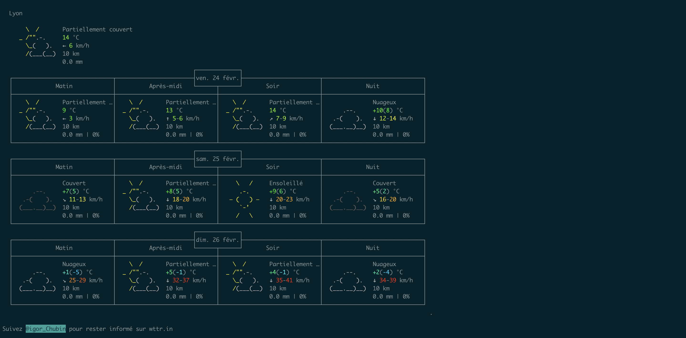
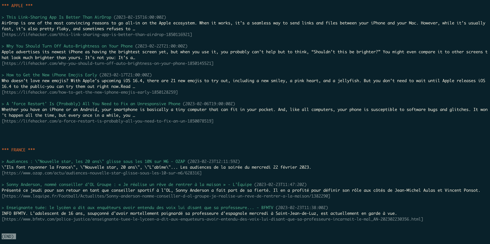

## Table of Contents

1. [Purpose](#purpose)
1. [Requirement](#requirement)
2. [Instalation](#instalation)
3. [Customization](#customization)

## PURPOSE:

This project is about displaying the weather and some news about subject you likes and your country each time you launch a terminal.
These informations are shown in a window which had to be close tapping 'q' key.

#### Example execution




## REQUIREMENT
This project use an API called NewsAPI, you need to generate a key on their [website](https://newsapi.org), it's fully free you just had to create an account.

## INSTALATION
Type the folowings commands lines in your ```$HOME``` directory:

```
git clone https://github.com/Thib1708/print_news.git; cd print_news; make; cd ..
```

Then copy/paste these commands in your ```~/.zshrc```
```
export SUBJECT="Apple"
export COUNTRY="fr"
export API_KEY="copy/paste the api key"
export CITY="Lyon"

curl -s fr.wttr.in/$CITY\?tpq > ~/todays_news

curl https://newsapi.org/v2/everything -G \
    -d q=$SUBJECT \
    -d sortBy=popularity \
    -d apiKey=$API_KEY> ~/$SUBJECT

curl https://newsapi.org/v2/top-headlines -G \
    -d country=$COUNTRY \
	-d sortBy=popularity \
    -d apiKey=$API_KEY > ~/$COUNTRY
cd ~
./print_news/print_news ~/$SUBJECT ~/$COUNTRY >> ~/todays_news
cat ~/todays_news |& less
```
## CUSTOMIZATION

You can modifie the export's lines in .zshrc :

-CITY : according to your location to get the weather

-SUBJECT : to get articles about a subject you like

-COUNTRY : to get the top headline of your country
([Here](asstes/country.txt) are all the availble country)

You can display articales about more than one subject by adding other export SUBJECT[1..n], add this command:
```
curl https://newsapi.org/v2/everything -G \
    -d q=$SUBJECT[1..n] \
    -d sortBy=popularity \
    -d apiKey=$API_KEY> ~/$SUBJECT[1..n]
```
And add the new var to this command :
```
./print_news/print_news ~/$SUBJECT[1..n] ~/$COUNTRY >> ~/todays_news
```

You can also modifie the colors in ~/print_news/include/print_news.h
